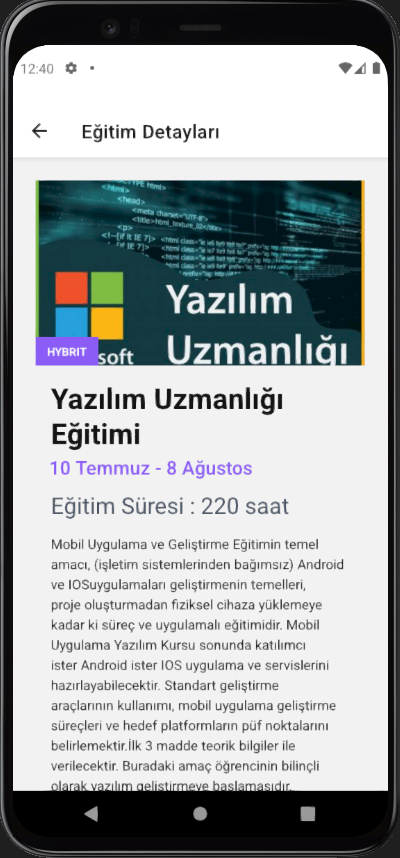

# Eğitim Firması Mobil Uygulaması

Bu proje, eğitim firması için geliştirilen etkileyici bir mobil uygulamayı içermektedir.

Kullanıcılar, uygulama üzerinden eğitimlerin tam listesine göz atabilir, her bir eğitimin ayrıntılı bilgilerini inceleyebilir ve kayıt olmadan bile başvurabilecekleri eğitimlere başvurabilirler.

Eğitim Firması Mobil Uygulaması, kullanıcı dostu arayüzü ve zengin içeriğiyle eğitim alanında öne çıkmaktadır. Kullanıcıların eğitimlere kolay ve hızlı bir şekilde erişmesini sağlayarak, öğrenme deneyimlerini daha da güçlendirir.

Bu uygulamada veriler, firestore'dan firebase kullanarak çekilmiştir.

## Uygulama Resimleri

## Kurulum

Projeyi yerel bilgisayarınıza klonlayın ve gerekli bağımlılıkları yüklemek için aşağıdaki adımları takip edin:

1. Git repoyu klonlayın:

git clone https://github.com/yasin03/education-app.git

2. Proje dizinine gidin:

cd edu-app

3. Gerekli bağımlılıkları yükleyin:

npm install or yarn

## Kullanılan Teknolojiler

Proje, aşağıdaki teknolojileri kullanmaktadır:

- React Native
- React Native Navigation
- Firebase
- Expo
- Native Base

## Kullanım

Uygulamayı başlatmak için aşağıdaki adımları izleyin:

1. Projeyi çalıştırın:
   expo start or yarn start

2. Expo geliştirici arayüzü açılacaktır. Burada emülatörde veya gerçek cihazda uygulamayı başlatabilirsiniz.

3. Uygulama, kayıt olma, giriş yapma, eğitim programlarına göz atma ve diğer özellikleri içerecektir. Lütfen uygulamanın kullanımıyla ilgili belgelendirmeyi inceleyin.

## Katkıda Bulunma

Eğer bu projeye katkıda bulunmak isterseniz, lütfen şu adımları izleyin:

1. Fork yapın.

2. Yeni bir branch oluşturun:
   git checkout -b feature/your-feature

3. Değişikliklerinizi yapın ve commit'leyin:
   git commit -am 'Add your feature'

4. Branch'inize push yapın:
   git push origin feature/your-feature

5. Pull request oluşturun.
